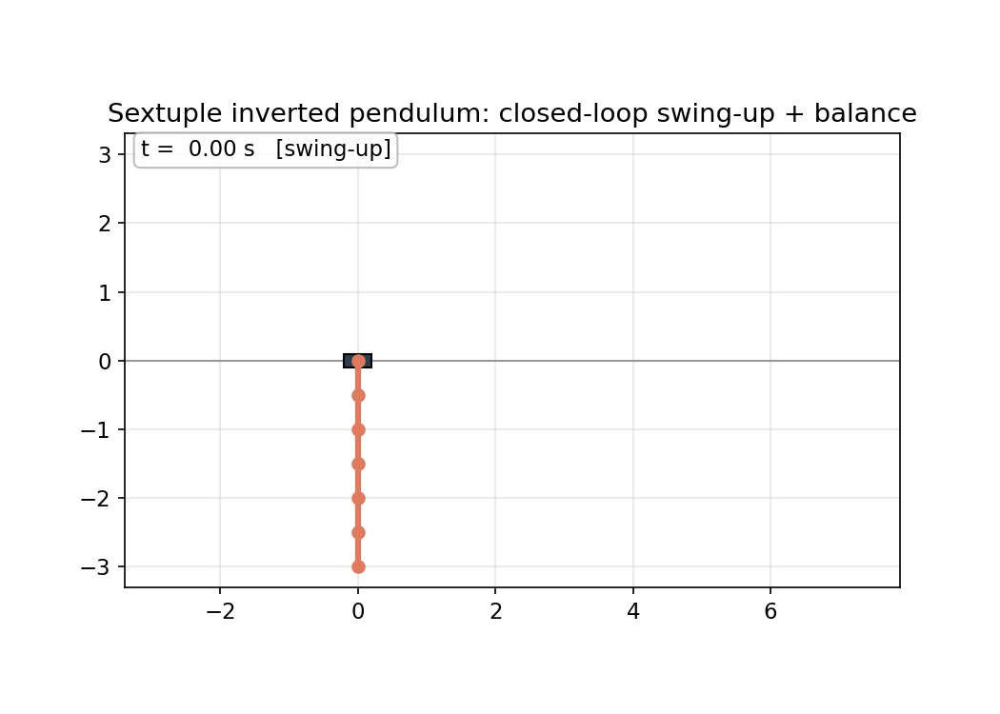

# Sextuple Cart-Pole: an open-source, code-reproducible n=6 cart swing-up + balance artifact

This repo extends the n=5 release at
https://github.com/eight-state/quintuple-cartpole to six links. It uses
the same method (Glück/Kugi exact inversion, collocation polish, whole-trajectory
TVLQR) and the same runtime, documented in full there. This README and
[docs/METHOD.md](docs/METHOD.md) cover only what is new at n=6: the cc-iLQG 1 ms
refinement that produced the shipped nominal, the 6-link nominal and its numbers,
and the closed-loop validation. The closed loop reproduces from a clean clone
after a one-time `uv sync` followed by a single run command.



*(Demo-rollout note: the unperturbed demo above peaks at 43.9 N, higher
than the 38.6 N max over the perturbed validation runs, because the demo's
handoff transient differs from the ensemble's; both are well under the
60 N validation bound.)*

> **The claim, stated narrowly.** From what our search found, this is the first
> public, code-reproducible, non-RL n=6 cart-pole swing-up-and-balance artifact:
> released, runnable, validated code, a saved-nominal replay plus saturated
> closed-loop validation against a strict committed predicate, reproducible after a
> one-time `uv sync` with a single run command, built by exact-inversion trajectory
> design rather than learning. A pre-existing code-less or RL-only result may show
> the same feat; what is new here is the released, runnable, validated, non-RL
> code, not the feat. It is a saved-nominal replay + validation artifact (the
> from-scratch nominal generator is documented in METHOD but not shipped). It is
> **not** the first 6-link pendulum solve, **not** the first public 6-pendulum
> cartpole, **not** hardware, and **not** a formal robustness proof.
>
> **We concede the public-first 6-solve to yacine.** On 2026-06-09 yacine
> (@yacineMTB) publicly posted a 6-pendulum cartpole swing-up/balance trained with
> RL (pufferlib, its standard PPO) in MuJoCo. That was posted
> publicly first, with no reproducible code artifact released alongside it. We
> hold a local build timestamp but no public proof of priority, so we make none.
> This repo's contribution is the reproducible, non-RL artifact. Full accounting
> in [docs/PRIOR_ART.md](docs/PRIOR_ART.md).

---

## Built on the n=5 release

The full method (why general-purpose trajectory optimization fails on the
unstable non-minimum-phase plant, the Glück/Kugi exact input-output inversion,
the stable multiple-shooting BVP with n-continuation, the direct-collocation
continuity polish, and whole-trajectory TVLQR) is documented in the n=5 repo at
https://github.com/eight-state/quintuple-cartpole. The `src/cartpole_race`
runtime here is the same dynamics and controller spine. n=6 is reached by
continuation from the n=5 nominal, with one new step: a native-compiled cc-iLQG
refinement that takes a 2.5 ms collocation seed to a bit-exact 1 ms nominal in
about 8 s. That step and the 6-link results are the subject of this repo. The
n=5 README covers everything the two releases share.

## Verification boundary

> **"Empirically validated" / "script-verified" in this repo means:** the
> committed scripts reproduce the stated success **counts** when the closed loop
> runs in the force-saturated simulator (`rollout_zoh`, hard `np.clip`, RK4
> sub-stepping) from perturbed initial conditions drawn from the documented
> Gaussian distribution at a fixed seed, judged against the committed success
> predicate (every link `|θ|≤5°`, `|θ̇|≤0.5`, `|x|≤2 m`, `|ẋ|≤0.5`, held
> continuously for the final 5 s, and on-track over the whole rollout; predicate
> `v1`). The actuator force is clipped to the bound by construction (hard
> `np.clip`), so it is trivially within bound and gates nothing; the meaningful
> gates are the track limit and the continuous 5 s hold. The actuator is allowed
> to ride saturation, disclosed via the committed saturation count and peak
> demanded force. It is **not** a formal proof of stability or
> robustness and **not** a hardware result. Counts are reproducible (seeded RNG
> plus fixed-step RK4/ZOH); only wall-time varies. Every count below is backed by
> a committed JSON in `results/`. **Reproducible here means** the closed-loop
> validation of the committed nominal reproduces bit-stable counts from a clean
> clone; regenerating the nominal from scratch (inversion + collocation + cc-iLQG)
> is documented in METHOD but not shipped and is not part of the one-command
> repro.

## The n=6 delta: a native 1 ms nominal

The n=6 nominal shipped here is on the native 1 ms grid (7000 control intervals
over 7.0 s, 14-state), at parity with the n=4 and n=5 nominals. It is
self-consistent by construction: cc-iLQG integrates the exact 1 ms 4-substep ZOH
tick the simulator runs, so the saved trajectory satisfies the discrete 1 ms ZOH
dynamics exactly (1-step ZOH defect 0.0), link by link. This removes the
node-spacing-vs-control-rate gap; it is not a continuous-dynamics accuracy claim.
The terminal max link angle is 0.246° and the peak feedforward is 21.56 N.

What produced it is the one piece of new machinery in this release. A 2.5 ms
collocation seed was refined to the 1 ms grid by a cell-correction iLQG
(cc-iLQG) pass running against a native MSVC-compiled 14-state Jacobian. The
compiled Jacobian makes the per-iteration linearization fast enough that the full
2.5 ms-to-1 ms refinement finishes in about 8 s, where the n=5 collocation polish
to 1 ms took roughly 40 min of IPOPT. Because cc-iLQG integrates the exact 1 ms
4-substep ZOH tick, the result is self-consistent by construction, so TVLQR
linearizes along a path the plant follows at the exact control tick the simulator
runs, with no interpolation gap between node spacing and control rate. This closes
the node-spacing-vs-control-rate gap; it is not a continuous-dynamics accuracy
claim.

[`configs/nominal.py`](configs/nominal.py) pins the nominal filename, the grid,
and the `is_native_1ms` flag. `reproduce_n6.py`, `scripts/demo_sextuple.py`, and
`scripts/gen_validation_reports.py` all read the nominal from there. The committed
validation JSONs in `results/` were generated against this 1 ms nominal.

## Result: n=6, empirically validated in saturated simulation

- **Full swing-up.** All 6 link angles go π → 0 (hanging to upright) and the cart
  returns near its start. Every link inverts, including the inner ones. The polished
  nominal ends with all links within 0.246° of upright.
- **1 ms-consistent nominal.** The saved trajectory
  (`results/nom_n6_gluck_cont.npz`, 7.0 s, 7000 intervals, 14-state) is
  self-consistent by construction on the native 1 ms grid: cc-iLQG integrates the
  exact 1 ms 4-substep ZOH tick, so the 1-step ZOH defect is 0.0 (this closes the
  node-spacing-vs-control-rate gap, not a continuous-dynamics accuracy claim). The
  collocation polish removes the boundary jumps left by the raw inversion plan.
  This is at parity with the n=4 and n=5 nominals.
- **Closed-loop empirically validated** in the saturated sim (`rollout_zoh` with
  hard force clipping), under perturbed initial conditions, script-verified
  against the committed predicate (each leg backed by a JSON in `results/`; see
  [docs/VALIDATION_REPORTS.md](docs/VALIDATION_REPORTS.md)):
  - **48/48** catches across two seeds at σ=0.02 (~1.1°/link), 60 N bound
    (`clvalidate_n6_F60_banked_seed12345.json` 24/24 +
    `clvalidate_n6_F60_banked_seed999.json` 24/24). Monodromy ρ ≈ 0.0270. This
    48/48 is at σ=0.02 only: n=6 robustness is not characterized under stress
    (no 5× stress leg, unlike n=5's σ=0.10 leg).
  - Peak cart force over all validation runs ≤ 38.6 N, far inside the 60 N
    validation bound and the 150 N model spec. Zero ticks clipped in any run.
- **Peak cart force.** Nominal 21.56 N, validation ≤ 38.6 N. Both sit far inside
  the 60 N validation bound and the 150 N spec.
- **Cart excursion.** The rail bound is ±10 m; success requires `|x| ≤ 2 m` only
  during the final 5 s hold. The peak cart excursion is 4.58 m during the
  swing-up (n=6 nominal peak `|x|` = 4.582 m, range 4.625 m), before the cart
  settles back inside ±2 m for the hold. The travel is one-sided: the nominal runs
  from x ≈ 0 out to about +4.58 m and back, so the ~4.58 m figure is one-sided
  reach, not a half-width. This is larger than n=5 (which peaks at 3.69 m) and is
  hardware-relevant: peak |x| over validation is 4.69 m (nominal 4.58 m), so a
  real n=6 rig needs >=5 m one-sided travel plus margin, or the nominal re-solved
  under a tighter track constraint.
- **Monodromy** spectral radius **ρ ≈ 0.0270** (≪ 1): the closed loop contracts
  strongly along the nominal, an empirical contractivity indicator along the
  validated nominal, not a global stability proof.

### Robustness scope

The claim is robust to validated kicks with margin. At σ≈1° the peak validation
force is ≤ 38.6 N of a 60 N bound, about 20 N of headroom, zero ticks clipped. We
did not run a 5× stress leg for n=6, so the claim is robust to roughly 1° IC noise
with margin and is not characterized beyond that. A stronger kick or a tighter
bound would eventually produce clip-limited failures, as for n=5. The robustness
is to validated kicks, not unbounded.

---

## Limitations

This result lives in a simulator. It is a real, strictly gated milestone, and the
simulator omits the parts of the physical problem that make multi-pendulum control
hard:

1. **No joint friction or damping.** The plant is frictionless; real joints
   dissipate and add un-modeled dynamics.
2. **Ideal force actuator.** Cart force is applied directly, with no motor
   dynamics, bandwidth limit, delay, or backlash.
3. **Full-state feedback.** The controller is given the true state. A real rig
   measures only positions (cart plus joint angles) and must estimate velocities
   with an observer under noise.
4. **Disturbances are initial-condition kicks only.** No sensor noise, actuator
   latency, continuous disturbance, or parameter mismatch is injected.
5. **Favorable configuration.** Uniform light links (0.10 kg / 0.50 m) on a heavy
   1.0 kg cart give high control authority (peak force ~22 N of a 150 N spec).
   Graduated or heavier links would be harder.

The field's prestige results, such as the Glück et al. 2013 hardware triple, run
on real rigs with friction, real sensing, and state estimation; more links in sim
is not the same achievement as fewer links on hardware. The sim-to-real gap is
open and unquantified here. Closing it (identified friction, an actuator model,
sensor noise, an observer, parameter randomization, then hardware) is the next
work, not a settled result.

---

## Quickstart (one-time `uv sync`, then a single run command)

Requires [`uv`](https://docs.astral.sh/uv/) and Python 3.11 to 3.12.

```bash
uv sync                          # one-time: create the pinned environment
uv run python reproduce_n6.py    # build TVLQR, validate closed-loop, regen GIF
```

This loads the nominal selected in [`configs/nominal.py`](configs/nominal.py)
(the native 1 ms-grid `results/nom_n6_gluck_cont.npz`), builds whole-trajectory
TVLQR, computes the closed-loop monodromy ρ, runs the perturbed-IC ensemble in the
saturated sim at the 60 N bound across the two banked seeds, prints the success
fraction for each, and regenerates `results/demo_sextuple.gif`. Expected: 24/24 +
24/24 = 48/48, ρ < 1.

Single-rollout demo plus plots only:

```bash
uv run python scripts/demo_sextuple.py
```

Tests:

```bash
uv run pytest
```

The from-scratch synthesis that generates this nominal (the inversion BVP, the
collocation polish, the cc-iLQG 1 ms refinement, n-continuation 2→3→4→5→6) is
slow; the method and the per-stage schedule are in [docs/METHOD.md](docs/METHOD.md)
and, for the shared stages, in the n=5 repo. This repo ships the validated n=6
nominal and the saved-nominal replay above (one-time `uv sync`, then a single run
command).

---

## Repository layout

```
sextuple-cartpole/
├── README.md                  # this file
├── LICENSE                    # MIT, © 2026 Alex Garcia Gil
├── pyproject.toml             # pinned deps (uv), Python 3.11 to 3.12
├── reproduce_n6.py            # ONE-COMMAND headline reproduction (n=6)
├── configs/
│   ├── nominal.py             # single source of truth: nominal file + grid
│   └── env-base.yaml          # frozen physical/timing spec (tests load this)
├── docs/
│   ├── METHOD.md              # n=6 deltas: cc-iLQG 1 ms refinement, nominal, novelty
│   ├── PRIOR_ART.md           # prior-art table (yacine 6-solve conceded)
│   └── VALIDATION_REPORTS.md  # what each committed validation JSON contains
├── src/cartpole_race/         # shared dynamics + controllers (same as n=5)
│   ├── dynamics.py            # n-link cart-pole EOM (CasADi), RK4 ZOH rollout
│   ├── env_spec.py            # frozen physical/timing spec
│   ├── lqr.py                 # static upright LQR (CARE)
│   ├── tvlqr.py               # time-varying LQR along a nominal
│   ├── rollout.py             # simulate_handoff (TVLQR -> static LQR)
│   └── funnels.py             # locked success predicate (in_success_set)
├── scripts/
│   ├── r2_validate.py         # perturbed-IC study + monodromy machinery
│   ├── cl_validate16.py       # CLI wrapper to validate any saved nominal
│   ├── gen_validation_reports.py # writes per-leg + combined JSON reports (n=6)
│   └── demo_sextuple.py       # single rollout + GIF/plots
├── results/
│   ├── nom_n6_gluck_cont.npz  # the validated n=6 nominal (native 1 ms grid)
│   ├── demo_sextuple.gif      # the headline animation
│   ├── clvalidate_n6_F60_banked_seed12345.json  # 24/24 leg of the 48/48
│   ├── clvalidate_n6_F60_banked_seed999.json    # 24/24 leg of the 48/48
│   └── combined_validation_report.json          # both legs + totals
└── tests/                     # dynamics consistency, linearization, LQR, TVLQR
```

n=6 is shipped on the native 1 ms grid (parity with n=4 and n=5). For higher link
counts, see the closing note in [docs/METHOD.md](docs/METHOD.md).

## Physical model

Uniform links: cart 1.0 kg, each link 0.10 kg / 0.50 m, g = 9.81 m/s², no
damping. State `[x_cart, θ₁..θₙ, ẋ, θ̇₁..θ̇ₙ]`, absolute world angles, θ=0 up,
θ=π down (n=6: 14-state). Control: cart **force** (the sim is force-saturated),
1 kHz ZOH, RK4 sub-stepping. The success set: every link `|θ|≤5°`, `|θ̇|≤0.5`,
`|x|≤2 m`, `|ẋ|≤0.5`, held continuously for the final 5 s.

## License

MIT (see [LICENSE](LICENSE)). © 2026 Alex Garcia Gil.
