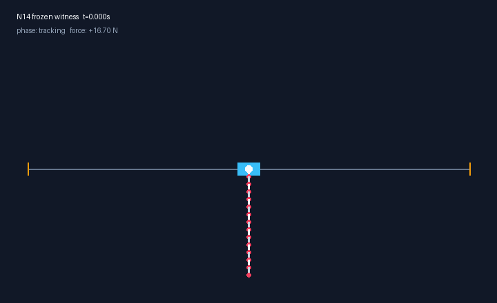

# Quattuordecuple Cart-Pole

This repository reproduces the N14 cart-pole release from frozen controls in deterministic simulation.



## Reproduce

```text
uv sync --locked
uv run n14-verify
```

`n14-verify` returns PASS only when the three frozen artifacts, 21 source hashes, exact-hanging replay, force bound, quarter-step rail bound, and success-run checks all pass. The command prints one JSON report and exits nonzero when an assertion fails.

```text
uv run n14-release
uv run ruff check .
uv run mypy
uv run pytest
```

`n14-release` atomically regenerates `artifacts/verification.json` after a complete PASS. Both console commands require the source capsule. An installed wheel returns `source_capsule_required` and exits 1.

The retained report records the original host's exact metrics. The live gate requires the frozen hashes, physical bounds, exact hanging start, and at least 5,001 trailing success states. Exact host-to-host metric comparisons remain diagnostic.

## Locked result

- Fourteen links: 0.10 kg and 0.50 m each
- Cart: 1.0 kg
- Damping: zero
- Force bound: ±150 N
- Rail bound: ±10 m
- Control: 1 kHz zero-order hold
- Integration: four recursive 0.25 ms RK4 steps per control
- Switch tick: 6,009
- Peak raw force: 87.54201341513544 N
- Quarter-step cart peak: 7.098485449991383 m
- Longest success run: 13,811 states across 13.81 s

## Repository map

- [`docs/METHOD.md`](docs/METHOD.md): plant, integration, success predicate, and replay method.
- [`docs/RELEASE_EVIDENCE.md`](docs/RELEASE_EVIDENCE.md): witness metrics and provenance links.
- [`PROVENANCE.md`](PROVENANCE.md): source lineage and archive hashes.
- [`artifacts/MANIFEST.json`](artifacts/MANIFEST.json): three frozen artifact hashes.
- [`artifacts/source-sha256.json`](artifacts/source-sha256.json): audited source hashes.

## Scope

The release certifies one deterministic trajectory under the locked model. Its scope excludes perturbation robustness, a region of attraction, formal guarantees, and hardware behavior.

The public Git commit anchors the published source identity. The artifact manifest and source lock expose drift within that commit.

## License

MIT. See [LICENSE](LICENSE).
