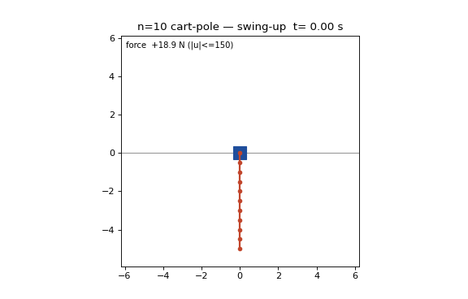

# Decuple Cart-Pole: an open-source, code-reproducible n=10 cart swing-up + balance artifact

Sixth rung: this repo extends
[quintuple](https://github.com/eight-state/quintuple-cartpole) (n=5),
[sextuple](https://github.com/eight-state/sextuple-cartpole) (n=6),
[septuple](https://github.com/eight-state/septuple-cartpole) (n=7),
[octuple](https://github.com/eight-state/octuple-cartpole) (n=8) and
[nonuple](https://github.com/eight-state/nonuple-cartpole) (n=9) to **ten
links** on a single 150 N cart. Nominal generation is the ladder stack (Glück
MS continuation → 4 ms `w_v` collocation polish → densification → exact-ZOH
discrete-time TVLQR); the perturbed-IC gate is the **same pre-roll architecture
as n=9, with zero re-tuning**. Physics, saturated simulator, perturbation model,
and the locked success predicate are byte-for-byte the n=5..9 releases'. The
gate runs the same three seeds as n=9 (12345, 777, 2024).

> **The claim, stated narrowly.** From what our search found, this is the
> first public, code-reproducible n=10 cart-pole swing-up-and-balance artifact
> by any method (the published field stops at n=4; our n=5..9 releases
> extended it). It is: released, runnable, validated code; a saved-nominal
> replay plus saturated closed-loop validation against the same strict
> committed predicate as the siblings; reproducible after a one-time `uv sync`.
> The headline robustness number uses a **pre-roll** controller that actively
> settles the perturbation at the *hanging* (stable) start back to the nominal,
> then tracks ONE fixed nominal — no per-IC NLP. It is **not** hardware,
> **not** a formal robustness proof, and full-state feedback with an exact
> model is assumed throughout.



## Headline numbers

| Quantity | Value |
|---|---|
| Plant | 10 links x 0.5 m x 0.1 kg, cart 1.0 kg, no damping, ±150 N, ±10 m track |
| Simulator | 1 ms ZOH, RK4 (0.25 ms substeps), hard `np.clip` force saturation |
| Nominal | 10.0 s, peak feedforward **36.0 N** (4.2x margin), terminal 0.0115° |
| Parent NLP | 2500 nodes / 4 ms, RK4-4ms transcription defect **1.36e-7**, `w_v=1e-3` (tight) |
| Densification seams (4 ms boundaries) | max **8.20e-6** |
| Closed-loop monodromy (discrete TVLQR) | **rho = 0.1042** |
| Unperturbed swing-up + hold | **PASS** (swing peak 36.0 N; **un-saturated** static-LQR catch at 98.6 N, holds 10.6 s continuous in-set — cleaner than n=9) |
| Perturbed gate, **pre-roll** (fixed nominal, no replan), σ=0.02 | **24/24** on **each** of seeds 12345, 777, 2024 (**72/72**), ~3.5 min/seed |

**Read the gate row precisely.** The σ=0.02 perturbation lives at the *hanging*
(stable) start. The pre-roll runs a fixed LQR-about-down to settle the perturbed
IC back inside the swing-up track's robustness radius, then the verified
fixed-nominal TVLQR track + static-LQR hold — one LQR gain, no per-IC NLP. All
three gate JSONs are banked in `results/`. Wilson-95 lower bound at 24/24 is
0.862.

> **The n=10 story is that there is barely a new story.** The pre-roll gate
> architecture (settle-at-down → TVLQR track → static hold) that reached
> release-grade at n=9 ported to n=10 with **zero re-tuning** and produced
> 24/24 × 3 seeds again. n=10 is in several ways *gentler* than n=9: peak
> feedforward 36 N vs 41 N, peak swing-up link rate 11.1 rad/s vs 12.5, and the
> unperturbed catch holds **un-saturated at 98.6 N** where n=9's catch pins the
> 150 N clip. Two consecutive rungs now pass release-grade with the same
> fixed-architecture, no-per-IC-NLP controller.

> **Honest caveats.** (a) The gate's hold is watched over a 10 s window (the
> catch has a multi-second settling transient at this stiffness); a short
> window truncates it and looks like a fail — it isn't. (b) Episodes are long
> (up to ~9 s pre-roll + 10 s swing-up + hold). (c) The `t` (tight) suffix on
> the nominal marks a required re-solve: an earlier `acceptable_tol=1e-4`
> shortcut left transcription defect 5.6e-6 and the track blew through the
> stiff t≈2.23 s window (defect kicks amplified ~5000× → saturation); the
> tightened re-solve with exit rule `defect<1e-6 ∧ dual<5e-4` fixed it. The
> shipped nominal is the tight one. This is a genuine, verified, release-grade
> σ=0.02 pass.

For scale: at the upright equilibrium this plant has **ten unstable modes**
sharing one bounded input, and the **36.0 N** peak feedforward is ≈ a quarter
of the 150 N actuator. As across the whole ladder, force is nowhere near
binding; the binding constraints are transcription fidelity, gain
discretization, and solver mode — controller numerics, not actuator authority.

## One-command reproduction

```bash
uv sync                          # one-time
uv run python reproduce_n10.py   # ~1 min: rigor facts + rho + unperturbed pass
uv run python reproduce_n10.py --gate   # full 24-IC pre-roll gate, all 3 seeds (~11 min)
uv run python -m pytest -q       # committed rigor gates
uv run python scripts/demo_decuple.py   # re-render results/demo_decuple.gif
```

The gate is a pre-roll with no per-IC NLP, so `--gate` finishes in minutes.
Each rollout is fixed-step RK4 + ZOH and deterministic; success counts are
machine-independent.

## Verification boundary

> **"Validated" here means:** the committed scripts reproduce the stated
> results in the force-saturated simulator (`rollout_zoh`, hard `np.clip`,
> RK4 sub-stepping) against the committed success predicate (every link
> `|θ|≤5°`, `|θ̇|≤0.5`, `|x|≤2 m`, `|ẋ|≤0.5`, held continuously 5.0 s,
> on-track throughout; predicate v1, `cartpole_race.funnels.in_success_set`),
> identical to the n=5..9 releases. The hold is measured as a continuous
> in-success-set run of ≥ 5.0 s inside a 10 s window. Full-state feedback,
> exact model, deterministic sim. Force-in-bound holds by construction
> (simulator clip). The pre-roll leg uses a fixed LQR-about-down + the fixed
> nominal — no per-IC replanning.

## Method

Nominal: continuation seed from the n=9 nominal (`gluck_n10_from_n9.py`),
one-shot 4 ms collocation with running velocity penalty `w_v=1e-3` and a tight
exit rule (`_n10_oneshot_wv.py`; **defect must reach ~1e-7** — see the tight
re-solve caveat above), densify to 1 ms, exact-ZOH discrete-time TVLQR
(rho=0.1042), static-LQR hold.

**Pre-roll gate (unchanged from n=9).** The σ=0.02 gate runs a fixed
LQR-about-down from the perturbed hanging IC to settle it back inside the
swing-up track's robustness radius, then the fixed-nominal TVLQR track + static
hold. `scripts/gate_preroll.py` is the n-generic form (`NLINKS`, `NOM_PATH`);
the n=9 and n=10 gates are the SAME code, same config.

See [docs/METHOD.md](docs/METHOD.md) for the full treatment and the n=9 release's
METHOD for the pre-roll architecture and NCR analysis.

## Repo map

```
reproduce_n10.py       # one-command reproduction (--gate for the pre-roll gate)
configs/nominal.py     # pins the shipped nominal + grid facts
src/cartpole_race/     # runtime (shared spine with n5..9)
scripts/
  _dtvlqr.py                    # exact-ZOH discrete-time TVLQR (reference)
  fast_pieces.py                # FastDTVLQR: batched-linearization discrete TVLQR
  gate_preroll.py               # THE pre-roll σ=0.02 gate (n-generic; NLINKS=10)
  gluck_n10_from_n9.py          # continuation seed generator (needs n9 seed)
  _n10_oneshot_wv.py            # the w_v=1e-3 tight 4 ms collocation that made the nominal
  _ncr_hard_bound.py            # controller-independent NCR bound (n-generic)
  demo_decuple.py               # render results/demo_decuple.gif
results/
  nom_n10_dense1ms_wv1en3t.npz  # THE shipped nominal (1 ms dense, tight)
  nom_n10_4ms_wv1en3t.npz       # 4 ms parent solve
  nom_n10_gluck.npz             # the MS continuation seed
  gate_n10_preroll_seed{12345,777,2024}.json   # pre-roll gate, 24/24 each
  gluck_n10_run.log             # the continuation seed log
tests/                 # committed rigor gates (defects, seams, rho, dynamics)
docs/METHOD.md, docs/PRIOR_ART.md
```

## License

MIT (see [LICENSE](LICENSE)). © 2026 Alex Garcia Gil.
