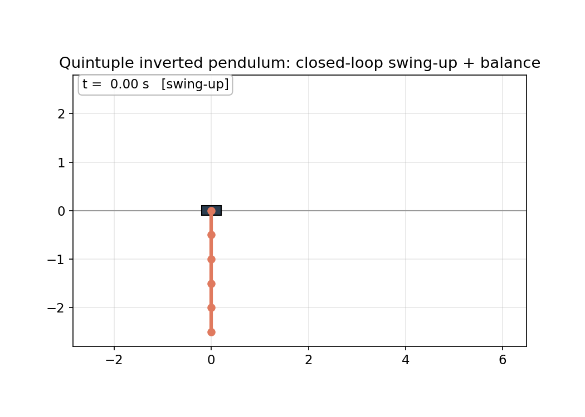

# Quintuple Cart-Pole: a public, code-reproducible n=5 cart swing-up + balance artifact

From what our search found, this is the first public, code-reproducible n=5
cart-pole swing-up-and-balance artifact: released, runnable, validated code for a
five-link cart-pole that swings itself up from hanging and balances. A
pre-existing code-less video (Ozana, VSB-TU Ostrava, ~2022) does show the same
feat in simulation: cart-driven quintuple swing-up and stabilization, verified
from the video's own description and frames; what is new here is the released,
runnable, validated code, not the feat. The closed loop is validated in
a saturated simulator and reproduces from a clean clone with one-time `uv sync`
setup followed by a single run command.



> **What this is.** The **first public, code-reproducible n=5 cart-pole
> swing-up-and-balance artifact**. It ships a saved, validated nominal trajectory
> plus the replay and validation pipeline, validates the closed loop in a
> saturated simulator against a strict committed predicate, and reproduces after a
> one-time `uv sync` with a single run command (the from-scratch nominal
> generator is documented in METHOD but not shipped). The boundary: this is an
> empirical validation,
> not a formal proof. Prior n=5 work
> exists (a code-less video, an Isaac-Sim stabilization paper, base-torque
> balance chains, and the peer-reviewed hardware triple); the full accounting and
> how each one differs is in [docs/PRIOR_ART.md](docs/PRIOR_ART.md). The "first"
> claim is scoped to a public reproducible cart swing-up artifact; the four prior
> items each sit on the wrong side of one axis (no code, balance not swing-up,
> base-torque not cart, or hardware triple).

---

## Verification boundary

> **"Empirically validated" and "script-verified" in this repo mean this:** the
> committed scripts reproduce the stated success **counts** when the closed loop
> is run in the force-saturated simulator (`rollout_zoh`, hard
> `np.clip`, RK4 sub-stepping) from perturbed initial conditions drawn from the
> **documented** Gaussian distribution (fixed seed), and judged against the
> **committed** success predicate (every link `|θ|≤5°`, `|θ̇|≤0.5`, `|x|≤2 m`,
> `|ẋ|≤0.5`, held continuously for the final 5 s, and on-track over the whole
> rollout; predicate `v1`). The actuator force is clipped to the bound by
> construction (hard `np.clip`), so it is trivially within bound and gates
> nothing; the meaningful gates are the track limit and the continuous 5 s hold.
> The actuator is allowed to ride saturation, disclosed via the committed
> `n_saturated_ics` and `max_abs_force_demanded`. It is **NOT** a formal/mathematical proof
> of stability or robustness, and **NOT** a hardware result. Counts are
> reproducible (seeded RNG + fixed-step RK4/ZOH); only wall-time varies. Every
> count below is backed by a committed JSON in `results/`. **Reproducible here
> means** the closed-loop validation of the committed nominal reproduces
> bit-stable counts from a clean clone; regenerating the nominal from scratch
> (inversion + collocation + cc-iLQG) is documented in METHOD but not shipped and
> is not part of the one-command repro.

## Result: n=5, empirically validated in saturated simulation

- **Full swing-up**: all 5 link angles go π → 0 (hanging → upright) and the cart
  returns near its start. Every link inverts, including the inner ones.
- **1 ms-consistent nominal**: the saved trajectory is dynamically consistent
  under the simulator's ZOH step (4 RK4 substeps per 1 ms control tick, matching
  `rollout_zoh`; defect ~1.2e-13). The collocation polish removes the boundary
  jumps left by the raw inversion plan.
- **Closed-loop empirically validated** in the **saturated sim**
  (`rollout_zoh` with hard force clipping), under perturbed initial conditions,
  **script-verified against the committed predicate** (each leg backed by a JSON
  in `results/`; see [docs/VALIDATION_REPORTS.md](docs/VALIDATION_REPORTS.md)):
  - **64/64** catches across two seeds at σ=0.02 (~1.1°/link), 60 N bound
    (`clvalidate_n5_F60_banked_seed12345.json` 24/24 + `...banked_seed999.json`
    40/40).
  - **24/24** fresh (seed 7777, σ=0.02) **plus 24/24** under **5× stress**
    (seed 2024, σ=0.10, ~5.7°/link, initial-angle offsets up to ~18° (3σ of the
    σ=0.10 draw)), reproduced by `reproduce_n5.py` (`...fresh_seed7777.json`,
    `...stress_seed2024.json`).
  - These are two distinct claims at two distinct perturbation amplitudes:
    **88/88 at σ=0.02** (64 banked + 24 fresh) and **24/24 at σ=0.10** (5× stress).
    The two legs have no single pooled success rate, so they are never merged into
    one number.
- **Peak cart force**: nominal ~20 N, default-σ validation ~28 N. Both sit far
  inside the 60 N validation bound and the 150 N spec.
- **Cart excursion**: the rail bound is **±10 m**, and success requires
  `|x| ≤ 2 m` **only during the final 5 s hold**. During the swing-up the cart
  legitimately travels further: the n=5 nominal peaks at **|x| = 3.69 m** (range
  3.71 m) before settling back inside ±2 m for the hold, and the validation legs
  log `max_abs_x` of 3.76 to 3.82 m at σ=0.02, up to **4.08 m** under 5× stress,
  all well inside ±10 m. This is hardware-relevant: the ~4 m figure is one-sided
  travel from the start position, so a centered rail would need roughly ~8 m of
  span plus end margin, unless the nominal is re-solved under a tighter track
  constraint.
- **Monodromy** spectral radius **ρ ≈ 0.030** (≪ 1): the closed loop contracts
  strongly along the nominal (an empirical contractivity indicator along the
  validated nominal, not a global stability proof). ρ is computed once from the
  nominal linearization (force- and IC-independent), so the identical ρ quoted in
  each per-leg JSON is that single number, not a per-leg re-verification.

### Robustness scope

The claim is **robust with large margin at σ≈1°; zero margin (saturation-limited)
at σ=0.10**. At σ≈1° there is ~30 N of force headroom. The 5× stress leg (σ=0.10)
is robust **by riding the 60 N saturation**: **11 of its 24 ICs** hit the bound to
recover (committed `n_saturated_ics` field; the raw demanded force peaks at 139.9 N
before the clip), so the headroom there is zero. The actuator force is clipped to
the bound by construction, so "force within bound" is trivially true and gates
nothing; the meaningful gates are the track limit and the continuous 5 s hold, and
the actuator is allowed to ride saturation (disclosed via `n_saturated_ics` and
`max_abs_force_demanded`). That makes the stress leg legitimate saturated-actuator
robustness. A stronger initial-angle offset or a tighter bound would start
producing clip-limited failures. METHOD §1 gives the per-amplitude detail.

---

## Limitations

This result lives in a simulator. It is a real, strictly gated
milestone, and the simulator deliberately omits the parts of the physical problem
that make multi-pendulum control hard:

1. **Simulation, not hardware.** The field's prestige results (e.g. the Glück et
   al. 2013 hardware triple) run on real rigs with friction, real sensing, and
   state estimation. This is a 1 kHz simulator. "More links in sim" is
   not the same achievement as "fewer links on hardware."
2. **No joint friction or damping.** The plant is frictionless; real joints
   dissipate and add un-modeled dynamics.
3. **Ideal force actuator.** Cart force is applied directly, with no motor
   dynamics, bandwidth limit, delay, or backlash.
4. **Full-state feedback.** The controller is given the true state. A real rig
   measures only positions (cart plus joint angles) and must estimate velocities
   with an observer under noise.
5. **Disturbances are initial-condition offsets only.** No sensor noise, actuator
   latency, continuous disturbance, or parameter mismatch is injected.
6. **Favorable configuration.** Uniform light links (0.10 kg / 0.50 m) on a heavy
   1.0 kg cart give high control authority (peak force ~20 N of a 150 N spec).
   Graduated or heavier links would be harder.

The **sim-to-real gap is open and unquantified here**. Closing it (identified
friction, an actuator model, sensor noise, an observer, parameter randomization,
then eventually hardware) is the next work, not a settled result.

---

## Quickstart (one-time setup, then one run command)

Requires [`uv`](https://docs.astral.sh/uv/) and Python 3.11 to 3.12. Setup is
`uv sync` once; after that the headline reproduction is a single run command.

```bash
uv sync                          # one-time: create the pinned environment
uv run python reproduce_n5.py    # build TVLQR, validate closed-loop, regen GIF
```

The one-command path re-runs the fresh and stress legs and quotes the two
banked legs; to REGENERATE all four banked validation JSONs in-repo, run
`uv run python scripts/gen_validation_reports.py` (a few minutes; see
docs/VALIDATION_REPORTS.md).

This loads the validated nominal `results/nom_n5_gluck_cont.npz`, builds
whole-trajectory TVLQR, computes the closed-loop monodromy ρ, runs the
perturbed-IC ensemble in the **saturated sim** at the 60 N bound
(fresh + 5× stress), prints the **success fraction** for each, and regenerates
`results/demo_quintuple.gif`. Expected: **24/24 fresh, 24/24 stress, ρ < 1.**

The **nominal swing-up horizon is 6.0 s**; each closed-loop rollout that an IC is
judged over runs longer, **about 12 s** (6.0 s swing-up + the 5 s hold + a 1 s
settle budget). The 5 s continuous-hold predicate is checked over the tail of
that rollout. The JSONs record both as `nominal_horizon_s` and
`rollout_duration_s`.

The single-rollout demo + plots only:

```bash
uv run python scripts/demo_quintuple.py
```

Tests:

```bash
uv run pytest
```

The from-scratch synthesis that *generates* this nominal (the two-stage inversion
BVP plus 1 ms collocation polish, n-continuation 2→3→4→5) is slow: the original
n=5 polish took ~40 min wall. The full procedure, with the (T, a_max, mesh)
schedule, is documented in [docs/METHOD.md](docs/METHOD.md). This repo ships the
validated n=5 nominal and the single-command replay above (after the one-time
`uv sync`).

---

## Method: stable inversion instead of cold trajectory optimization

General-purpose trajectory optimization (direct collocation, iLQG, multi-start)
**fails** on this problem: the unstable, non-minimum-phase internal dynamics give
singular Jacobians, absurd accelerations, and non-upright local optima. We use
the **Glück/Kugi exact input-output inversion** (cart *acceleration* is the
input, the cart-position output has relative degree 2), which recovers the
feedforward algebraically and reduces the only hard part, the unstable internal
angle dynamics, to a **tiny saturated Fourier-coefficient boundary-value
problem** solved by **stable multiple-shooting inversion** with **n-continuation**
(2→3→4→5). We then **polish that in-basin plan with direct collocation** (grid
homotopy down to 1 ms) into a dynamically-consistent nominal and wrap it in
**whole-trajectory TVLQR**. The full method, the failure modes it avoids, and the
novelty accounting are in **[docs/METHOD.md](docs/METHOD.md)**.

---

## Timeline

The dates below run from the project folder's creation to the verified result.
Timestamps are local file-creation times on the development machine (NZST, UTC+12).

| Milestone | NZST (UTC+12) | Elapsed |
|---|---|---|
| Project folder created | 2026-06-06 01:10 | 0 |
| n=5 nominal solved | 2026-06-08 19:20 | ~66 h |
| n=5 closed-loop validation finished | 2026-06-08 19:42 | ~66.5 h |

---

## Repository layout

```
quintuple-cartpole/
├── README.md                  # this file
├── LICENSE                    # MIT, © 2026 Alex Garcia Gil
├── pyproject.toml             # pinned deps (uv), Python 3.11 to 3.12
├── reproduce_n5.py            # ONE-COMMAND headline reproduction (n=5)
├── docs/
│   ├── METHOD.md              # method + why-it-works + honest novelty
│   ├── PRIOR_ART.md           # prior-art table (cart vs not, swing-up vs balance)
│   └── VALIDATION_REPORTS.md  # what each committed validation JSON contains
├── src/cartpole_race/         # shared dynamics + controllers
│   ├── dynamics.py            # n-link cart-pole EOM (CasADi), RK4 ZOH rollout
│   ├── env_spec.py            # frozen physical/timing spec
│   ├── lqr.py                 # static upright LQR (continuous-time CARE)
│   ├── tvlqr.py               # time-varying LQR along a nominal
│   ├── rollout.py             # simulate_handoff (TVLQR -> static LQR)
│   └── funnels.py             # locked success predicate (in_success_set)
├── scripts/
│   ├── r2_validate.py         # perturbed-IC study + monodromy machinery
│   ├── cl_validate16.py       # CLI wrapper to validate any saved nominal
│   ├── gen_validation_reports.py # writes all per-leg + combined JSON reports
│   └── demo_quintuple.py      # single rollout + GIF/plots
├── results/
│   ├── nom_n5_gluck_cont.npz  # the validated n=5 nominal (headline)
│   ├── demo_quintuple.gif     # the headline animation
│   ├── clvalidate_n5_F60_banked_seed12345.json  # 24/24 leg of the 64/64
│   ├── clvalidate_n5_F60_banked_seed999.json    # 40/40 leg of the 64/64
│   ├── clvalidate_n5_F60_fresh_seed7777.json    # fresh 24/24
│   ├── clvalidate_n5_F60_stress_seed2024.json   # 5x stress 24/24
│   └── combined_validation_report.json          # all legs + totals
└── tests/                     # dynamics consistency, linearization, LQR, TVLQR
```

> **Scope is n=5.** A raw n=6 inversion plan exists upstream but is not part of
> this repo's committed, closed-loop-validated artifact (and its nominal travels
> even further on the rail than n=5), so this repo ships and claims n=5 only.

## Physical model

Uniform links: cart 1.0 kg, each link 0.10 kg / 0.50 m, g = 9.81 m/s², no
damping. State `[x_cart, θ₁..θₙ, ẋ, θ̇₁..θ̇ₙ]`, absolute world angles, θ=0 up,
θ=π down. Control: cart **force** (the sim is force-saturated), 1 kHz ZOH,
RK4 sub-stepping. The success set: every link `|θ|≤5°`, `|θ̇|≤0.5`, `|x|≤2 m`,
`|ẋ|≤0.5`, held continuously for the final 5 s.

## License

MIT (see [LICENSE](LICENSE)). © 2026 Alex Garcia Gil.
