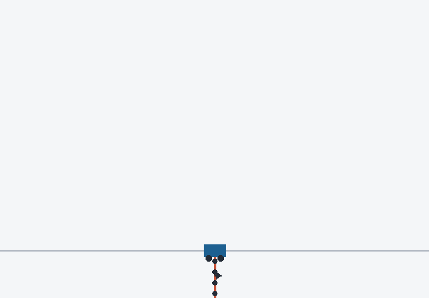

# Duodecuple Cart-Pole

This repository runs the N12 controller in a fresh simulation from exact hanging.



## Run

```text
uv sync --locked
uv run n12-demo
uv run n12-verify
```

`n12-demo` writes `.working/n12-demo.gif`; `n12-verify` writes `.working/n12-verify.json`.

## What runs locally

`n12-demo` loads only the 4 ms nominal from `artifacts/nom_n12_4ms_fast.npz`; it generates the dense reference, gains, states, forces, measurements, and GIF locally.

This repository does not support nominal synthesis or perturbation reruns. `artifacts/n12-evidence.json` retains the 72 banked fixed-seed trials.

## Read the code

The deterministic simulation path contains [`env_spec.py`](src/cartpole_race/env_spec.py), [`dynamics.py`](src/cartpole_race/dynamics.py), [`lqr.py`](src/cartpole_race/lqr.py), [`fast_pieces.py`](src/n12_cartpole/fast_pieces.py), [`simulator.py`](src/n12_cartpole/simulator.py), and [`success.py`](src/n12_cartpole/success.py). [`demo.py`](src/n12_cartpole/demo.py) renders the rollout; [`verifier.py`](src/n12_cartpole/verifier.py) audits it.

The claim covers deterministic simulation with full-state feedback. It excludes hardware, model mismatch, and formal guarantees.

This repository uses the [MIT License](LICENSE).
