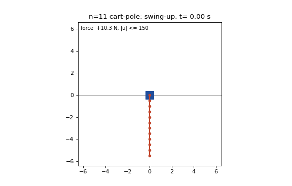

# Undecuple Cart-Pole

This repository packages an eleven-link cart-pole swing-up and balance result for deterministic, force-saturated simulation. It ships the fixed nominal trajectories, the three banked perturbed-initial-condition gate records, the plant and controller code, and the commands that recompute the published checks.



## Released result

| Quantity | Recomputed value |
|---|---:|
| Plant | 11 links, each 0.5 m and 0.1 kg; 1.0 kg cart; 150 N bound |
| Simulator | 1 kHz zero-order hold; RK4 with 0.25 ms substeps |
| Dense nominal | 10,000 control ticks over 10.0 s |
| Peak nominal feedforward | 35.1736243 N |
| Nominal terminal link error | 0.0114011 degrees |
| Banked gate | 24 of 24 successes for seeds 12345, 777, and 2024; 72 of 72 total |
| Wilson 95 percent interval for each 24 of 24 gate | [0.862, 1.000] |

The gate samples independent state coordinates from N(0, 0.02) at the hanging start. It runs a fixed LQR-about-down pre-roll for the full 9.0 s cap, tracks one fixed dense nominal with discrete TVLQR, then applies the static LQR hold. `PREROLL_TOL=0` and `PREROLL_VEL_Q_SCALE=4` pin the released pre-roll schedule. The gate runs no per-initial-condition trajectory optimization.

The success predicate requires every link to remain within 5 degrees and 0.5 rad/s, the cart to remain within 2 m and 0.5 m/s, and the trajectory to hold that set continuously for 5.0 s. The simulator clips applied force to the 150 N bound and rejects track excursions beyond the 10 m half-length.

## Reproduce

```bash
uv sync --locked
uv run python reproduce_n11.py
uv run python reproduce_n11.py --gate
uv run ruff check reproduce_n11.py scripts tests
uv run python -m pytest -q
uv run python scripts/demo_undecuple.py
```

`reproduce_n11.py` checks the five SHA256 digests, recomputes every banked gate count, recomputes the Wilson interval, checks each gate record against the release settings and predicate fields, recomputes nominal defects and monodromy, and reruns the unperturbed saturated closed loop. `--gate` runs the 72 episodes with `24 <seed> 9.0 6`, then requires the regenerated JSON files to match their banked hashes.

## Banked artifacts

| Artifact | SHA256 |
|---|---|
| `runs/r2/nom_n11_4ms_capture025_smoke3t03.npz` | `b190e1ff71fe5242c850e5eb817bf8401fc38f24f9e189e6b132e85471dcea86` |
| `runs/r2/nom_n11_dense1ms_capture025_smoke3t03.npz` | `1b7458cefe5d91aeaa012e78c4edbf586cd0d989df8e8e6f7adb2000cbae290d` |
| `runs/r2/gate_n11_preroll_seed12345.json` | `fd7650b59ff15a41ecab6e83e5eab0b16e6331681533b39a4161055d59748f8c` |
| `runs/r2/gate_n11_preroll_seed777.json` | `a64dfcbce1cfa9ef8235ecd49645059094a613d2f5a29dc6e4d659630d63a756` |
| `runs/r2/gate_n11_preroll_seed2024.json` | `b7f263356415fc8bef7ed8a7c9f71e3d8bbe71b52beb11805384e30434080942` |

The repository keeps the artifacts under `runs/r2/` because each banked gate JSON records that nominal path. `scripts/release_audit.py` validates the file hashes, metadata, result tags, counts, settings, force values, hold values, and Wilson intervals.

## Scope

`docs/METHOD.md` defines the plant, controller, gate, and success predicate. `docs/PRIOR_ART.md` records the comparison boundary.

The runtime core in `src/cartpole_race/`, `scripts/_dtvlqr.py`, and `scripts/fast_pieces.py` is byte-identical to the shared core in [decuple-cartpole](https://github.com/eight-state/decuple-cartpole). The MIT license carries the same 2026 Alex Garcia Gil copyright notice.

## License

MIT. See [LICENSE](LICENSE).
