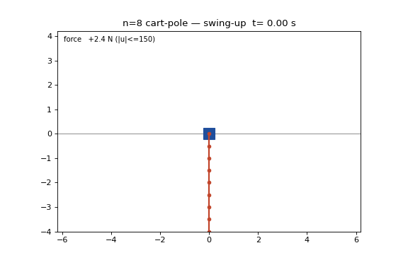

# Octuple Cart-Pole: an open-source, code-reproducible n=8 cart swing-up + balance artifact

Fourth rung this week: this repo extends
[quintuple](https://github.com/nzalexgarciagil-ctrl/quintuple-cartpole) (n=5),
[sextuple](https://github.com/eight-state/sextuple-cartpole) (n=6) and
[septuple](https://github.com/eight-state/septuple-cartpole) (n=7) to
**eight links** on a single 150 N cart. The nominal-generation method is the
n=7 stack unchanged (Glück MS continuation seed → one-shot 4 ms collocation
polish → densification → exact-ZOH discrete-time TVLQR), which is itself
evidence for the n=7 release's central claim: cross-n difficulty is controller
numerics, not a physical authority wall. The perturbed-IC **composite gate**
here is re-engineered for speed and steer robustness (a "fast stack": dual
warm-started replans + a primal warm-started catch NLP), but the physics, the
saturated simulator, the perturbation model, the seeds, and the locked success
predicate are byte-for-byte the n=5/6/7 releases'.

> **The claim, stated narrowly.** From what our search found, this is the
> first public, code-reproducible n=8 cart-pole swing-up-and-balance artifact
> by any method (the published field stops at n=4; our n=5/6/7 releases
> extended that). It is: released, runnable, validated code; a saved-nominal
> replay plus saturated closed-loop validation against the same strict
> committed predicate as the n=5/6/7 releases; reproducible after a one-time
> `uv sync`. The headline robustness number uses a **composite** controller
> that **re-solves the swing-up NLP per initial condition** (a heavier
> controller than n=5/6 needed): the perturbation is absorbed by causal,
> per-IC offline re-optimization, NOT rejected by fixed feedback. It is
> **not** hardware, **not** a formal robustness proof, and (like n=7) the
> arbitrary-IC single-input tightness at n=8 is side-stepped by replanning,
> not eliminated. "Causal" = measured state only, never rewinds; NO real-time
> claim is made; per-IC planning compute ranges minutes to hours (see
> `solve_s` in the JSONs).



## Headline numbers

| Quantity | Value |
|---|---|
| Plant | 8 links x 0.5 m x 0.1 kg, cart 1.0 kg, no damping, ±150 N, ±10 m track |
| Simulator | 1 ms ZOH, RK4 (0.25 ms substeps), hard `np.clip` force saturation |
| Nominal | 9.0 s, peak feedforward **23.2 N** (6.5x margin), terminal 0.0115° |
| Parent NLP | 2250 nodes / 4 ms, defect **2.1e-12**, 804 IPOPT iterations |
| Densification seams (4 ms boundaries) | max **4.2e-3** (vs 8.3e-5 at n=7; absorbed by feedback, peak closed-loop demand 23.2 N) |
| Closed-loop monodromy (discrete TVLQR) | **rho = 0.156** |
| Unperturbed swing-up + 5 s hold | **PASS** (swing peak 23.2 N, hold peak 77.7 N) |
| Perturbed gate, **fixed nominal + TVLQR** (n5/n6-equivalent controller), σ=0.02 | **8/24** (seed 12345), **16/24** (seed 777) |
| Perturbed gate, **+ per-IC replanning** (composite; minutes to hours per IC), σ=0.02 | **24/24** (seed 777), **24/24** (seed 12345), demanded force ≤ 100 N |

**Read the two perturbed-gate rows together; they are not the same
controller.** The n=5 (88/88) and n=6 (48/48) releases use ONE fixed nominal +
TVLQR feedback; at n=8 that same architecture lands only **8/24 to 16/24**
(first row), and n=8's catch is materially tighter than n≤7's (the n=7 fixed
leg was 18/24). The composite (second row) re-solves the swing-up NLP per IC to reach
**24/24 on both seeds**. Both are causal and real; they are different
controllers, and the table labels them as such. All four gate JSONs are banked
in `results/`.

> **Honest caveat on the composite 24/24: warm-start sensitivity at the
> trackability edge.** The composite gate's dual-warm-started replan makes the
> *tightest* ICs sensitive to the warm start. On seed 12345, tag&nbsp;4 sits
> right at the edge: it **passes as banked** (with the shipped `warmpack_n8.npz`,
> its replan finds a trackable plan) but **failed `A_track_diverged` under a
> different warm start in development** (a slightly different plan that diverged
> in the saturated sim). So the honest statement is **not** "robust 24/24";
> it is: *with the shipped code and shipped warmpack, both seeds reproduce
> 24/24, and one IC (12345 tag 4) is a knife-edge case whose pass/fail can flip
> with the warm start.* Reproducibility is conditioned on the shipped warmpack
> (that is why it is shipped, not regenerated). We disclose this rather than
> bury it. Seed 777 is 24/24 with no comparable edge case.

For scale: at the upright equilibrium this plant has **eight unstable modes**
(spectrum ~2.2 to 33) sharing one bounded input. The **23.2 N** above is the
*unperturbed nominal* swing-up (≈ a sixth of the 150 N actuator). The
**perturbed composite gate is more demanding**: its per-IC replans ride up to
the **100 N planning bound** (`U_PLAN`), i.e. every composite IC reports
`peakF`/`max_force_demanded` ≈ 99 to 100 N, still inside the 150 N clip with
~50 N feedback margin, but do not read the 24/24 robustness result as a "23 N"
result. The fixed-nominal leg's failed ICs diverge entirely, demanding
physically meaningless pre-clip forces (~1e8 N in the JSONs); the simulator
clips applied force to 150 N, so those are honest divergence signals, not a
budget the controller could ever deliver.

## One-command reproduction

```bash
uv sync                          # one-time
uv run python reproduce_n8.py    # ~3 min: rigor facts + rho + unperturbed pass
uv run python reproduce_n8.py --gate   # full 24-IC composite gate, both seeds
uv run python -m pytest tests/   # committed rigor gates
```

The composite gate's success **counts** are machine-independent (iteration-only
budget, single-threaded BLAS) **with `CARTPOLE_MAP_THREADS=1`** (the default,
which `reproduce_n8.py` uses); only per-IC wall time varies. Setting
`CARTPOLE_MAP_THREADS>1` builds a *different* (thread-parallel) CasADi graph
whose last-bit AD accumulation order can shift the disclosed knife-edge IC;
use it only to speed up exploration, not to reproduce the banked counts. Wall
time is memory-bandwidth-bound: ~8 to 12 h/seed on a dual-channel laptop, ~1
to 3 h on a high-bandwidth many-core box.

## Verification boundary

> **"Validated" here means:** the committed scripts reproduce the stated
> results in the force-saturated simulator (`rollout_zoh`, hard `np.clip`,
> RK4 sub-stepping) against the committed success predicate (every link
> `|θ|≤5°`, `|θ̇|≤0.5`, `|x|≤2 m`, `|ẋ|≤0.5`, held continuously 5.0 s,
> on-track throughout; predicate v1). The hold check requires a genuine 5.0 s
> (5001 in-set 1 ms samples), matching `rollout.static_hold_rollout` exactly.
> *Note:* the n=5/6/7 release gate scripts accept at `run >= int(5/dt)` (5000
> samples = 4.999 s), a 1 ms-lenient implementation of the same predicate;
> this n=8 release corrects it to an exact 5.0 s (the correction is not
> verdict-changing here, passing ICs hold upright indefinitely). Full-state
> feedback, exact model, deterministic sim. Force-in-bound holds by
> construction (simulator clip) and is not a gated check. The composite leg
> uses a heavier controller (per-IC replanning) than n=5/6 needed.

## Method

Nominal generation is the n=7 stack unchanged: continuation seed from the n=7
MS nominal (link 8 cloned from link 7, T stretched 8s→9s), one-shot 4 ms
collocation (the only n=8-specific lesson: chunked warm-restart IPOPT diverged
on every attempt at two grids, while the continuous one-shot solved both n=7
and n=8 (solver mode, not physics)), densify to the exact 1 ms sim grid,
discrete-time TVLQR (rho = 0.156), static-LQR hold.

**Fast-stack composite gate (delta vs n=7).** The per-IC controller is the n=7
composite (replan-at-t0, discrete TVLQR, steering-NLP catch, static hold), but
its solver internals are re-engineered (speed/robustness only; the honest
judge remains the downstream saturated-sim predicate):

- **Stage-A dual warm start** from the nominal's KKT multipliers: collapses
  the per-IC replan iteration count and its variance (the worst-case IC drops
  from ~12 h to ~30 min of solve on the reference laptop).
- **Steer primal warm start** from the nominal steer plan: the real handoffs
  cluster ~2e-4 rad from the nominal arrival, so the catch NLP converges in
  ~13 to 38 iterations where a cold start can stall at the 1500-iteration
  budget. This is verdict-changing: it is what lifts seed 777 to 24/24 (a cold
  steer leaves several handoff-perfect ICs failing only on catch
  non-convergence).
- **Per-step flat SX RK4 + thread-parallel defect map** and **mapaccum
  densify + batched-linearization TVLQR**: bit-identical to the serial graph;
  pure speed.

See [docs/METHOD.md](docs/METHOD.md) and the n=7 release's METHOD for the full
treatment including the refuted n=7 impossibility verdict.

## Repo map

```
reproduce_n8.py        # one-command reproduction (--gate for the composite gate)
configs/nominal.py     # pins the shipped nominals + grid facts
src/cartpole_race/     # runtime (shared spine with n5/6/7)
scripts/
  _dtvlqr.py                    # exact-ZOH discrete-time TVLQR (reference)
  fast_trajopt.py               # FastColloc: build-once NLP, dual warm start, threaded map
  fast_pieces.py                # mapaccum densify + batched-linearization TVLQR
  cl_validate_n8_composite.py   # THE composite gate (fast stack)
  cl_validate_n8_fixed.py       # fixed-nominal leg (n5/n6-equivalent controller)
  gluck_n8_from_n7.py           # continuation seed generator
  _n8_oneshot.py                # the 4 ms collocation polish that produced the nominal
  _ncr_hard_bound.py            # controller-independent NCR bound (n-generic)
results/
  nom_n8_dense1ms.npz           # THE shipped nominal (1 ms dense)
  nom_n8_4ms.npz                # 4 ms parent solve
  nom_n8_gluck.npz              # the MS continuation seed
  warmpack_n8.npz               # nominal KKT multipliers + steer plan (warm-start pack)
  clvalidate_n8_composite_seed777.json    # composite gate, seed 777 (24/24)
  clvalidate_n8_composite_seed12345.json  # composite gate, seed 12345 (24/24)
  clvalidate_n8_fixed_seed777.json        # fixed-nominal leg, seed 777 (16/24)
  clvalidate_n8_fixed_seed12345.json      # fixed-nominal leg, seed 12345 (8/24)
  n8_oneshot.log                # the solve + unperturbed-pass log
tests/                 # committed rigor gates (defects, seams, rho, ...)
docs/METHOD.md, docs/PRIOR_ART.md
```

## License

MIT.
